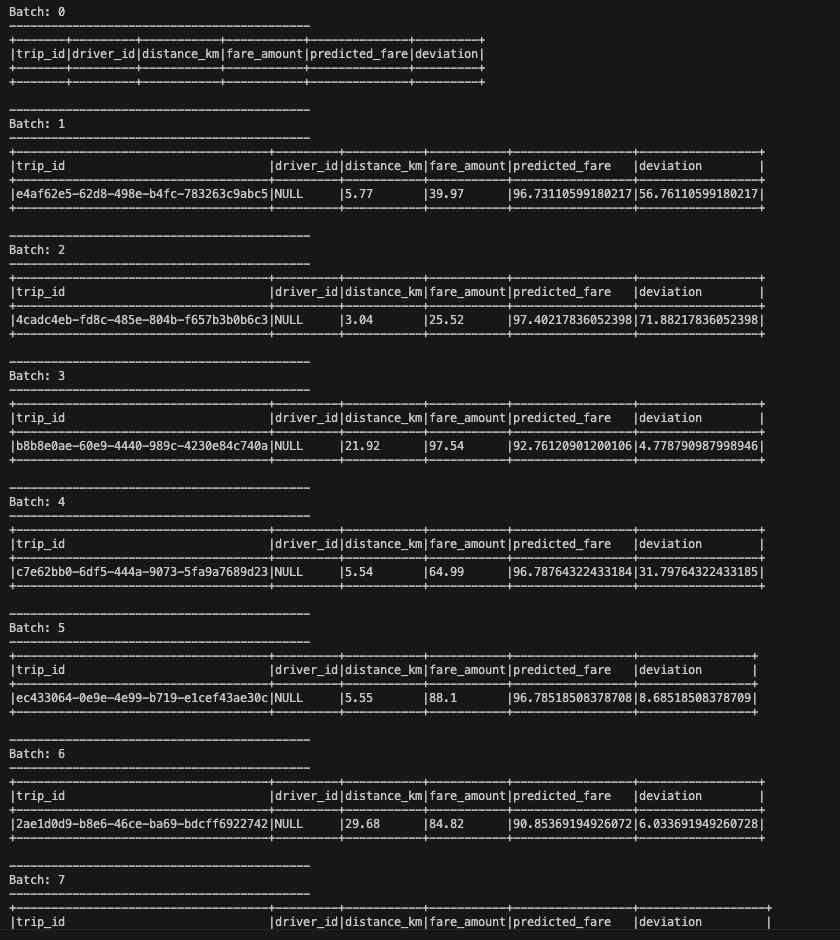
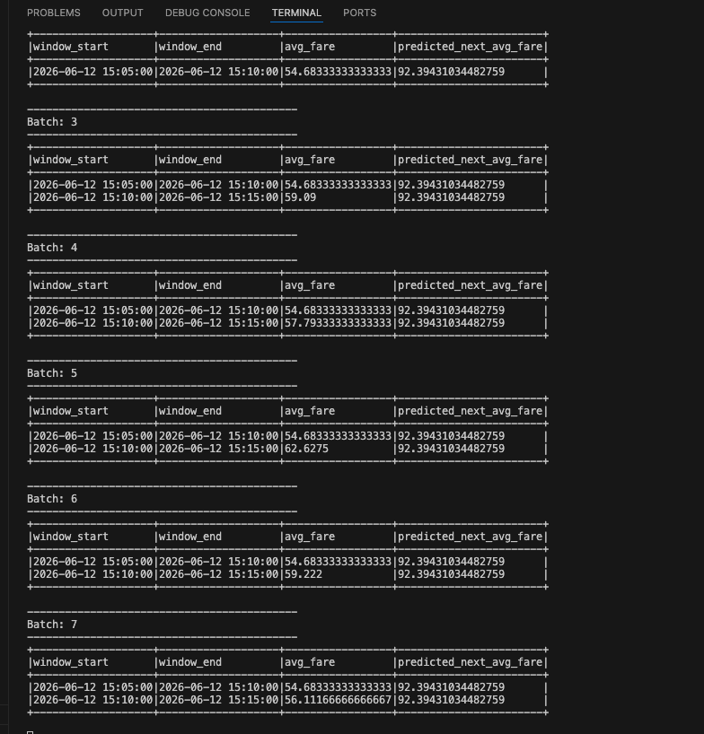

## Task 4: Real-Time Fare Prediction Using MLlib Regression

This task uses Linear Regression to predict fare amount based on ride distance. The streaming output includes the actual fare, predicted fare, and deviation.

## Task 5: Time-Based Fare Trend Prediction

This task aggregates streaming fare data into 5-minute windows and calculates the average fare for each window. A Linear Regression model is trained using `hour_of_day` and `minute_of_hour` to predict the average fare trend.

